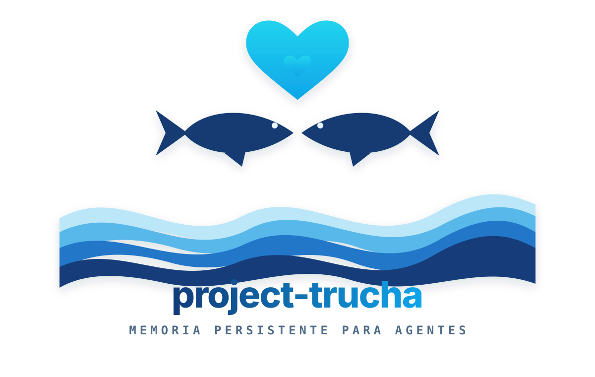

<p align="center">
<a href="https://www.linkedin.com/in/soriamaximilianorodrigo/" target="_blank" rel="noopener noreferrer">
</a>
</p>

<p align="center">
  <a href="#"></a>
  <a href="#"></a>
  <a href="https://github.com/MaximilianoRodrigoSoria/project-trucha/commits"></a>
  <a href="https://github.com/MaximilianoRodrigoSoria/project-trucha/stargazers"></a>
  <a href="#"></a>
  <a href="#"></a>
  <a href="#"></a>
  <a href="docs/slides/index.html"></a>
  <a href="#"></a>
</p>

---

# 🐟 project-trucha

Toolkit colaborativo y open source para dotar a los agentes de código de **memoria persistente** sobre un codebase local: indexar, recordar y recuperar contexto de un repositorio sin depender de infraestructura pesada.

> **Estado:** en etapa de decisión técnica. La arquitectura de almacenamiento todavía está abierta — ver [Decisión técnica: backend de memoria](#decisión-técnica-backend-de-memoria). Este README documenta la intención del proyecto y las opciones bajo evaluación, no un diseño cerrado.

> 📊 **Deck de presentación:** abrí [`docs/slides/index.html`](docs/slides/index.html) en el navegador para un recorrido navegable (← →) por qué vamos a construir y las decisiones técnicas — con diagramas de flujo animados. También disponible como artifact en Cowork.

---

## Contenido

- [¿Qué es project-trucha?](#qué-es-project-trucha)
- [Filosofía: la trucha](#filosofía-la-trucha-)
- [Alcance (MVP tentativo)](#alcance-mvp-tentativo)
- [Arquitectura tentativa](#arquitectura-tentativa)
- [Estructura del repositorio](#estructura-del-repositorio)
- [Decisión técnica: backend de memoria](#decisión-técnica-backend-de-memoria)
- [Instalación y uso (previsto)](#instalación-y-uso-previsto)
- [Documentación](#documentación)
- [Cómo contribuir](#cómo-contribuir)
- [Roadmap](#roadmap)
- [Stack tentativo](#stack-tentativo)
- [Alternativas para el stack](#alternativas-para-el-stack)
- [Equipo](#equipo)
- [Licencia](#licencia)

---

## ¿Qué es project-trucha?

Los agentes de código (asistentes que leen, escriben y razonan sobre un repositorio) son tan buenos como el **contexto** que pueden recuperar. Sin memoria persistente, cada sesión arranca de cero: re-escanea archivos, re-descubre convenciones y pierde las decisiones tomadas en sesiones anteriores.

**project-trucha** es un toolkit que resuelve ese problema de forma local y de baja fricción. La idea central es simple: mantener un índice persistente del codebase —léxico y semántico— que un agente pueda consultar en milisegundos, sin levantar servicios externos ni pagar latencia de red.

### ¿Qué problema resuelve?

Cuando un agente de desarrollo trabaja sobre un codebase real, necesita responder rápido preguntas como "¿dónde está definida esta entidad?", "¿qué decidimos sobre la autenticación la semana pasada?" o "¿qué archivos tocan este flujo?". Hoy eso implica, en cada arranque, re-leer el repo entero o depender de una base vectorial pesada. project-trucha busca ofrecer esa memoria como una pieza **embebida, portable y colaborativa**, para que cualquier equipo pueda montarla sobre su propio repositorio.

### Principios de diseño

| Principio | Qué significa |
|---|---|
| **Local-first** | Funciona sobre el codebase local, sin servicios externos obligatorios ni datos saliendo de la máquina. |
| **Baja fricción** | `pip install` y listo. Nada de levantar contenedores ni administrar un servidor para empezar. |
| **Portable** | El índice vive idealmente en un único archivo versionable/copiable, no en un servicio con estado propio. |
| **Búsqueda híbrida** | Combina recuperación léxica (exacta, por palabra clave) con semántica (vectorial) para cubrir ambos tipos de consulta. |
| **Baja latencia** | Pensado para consultas en el bucle del agente: milisegundos, no cientos de milisegundos. |
| **Colaborativo** | Convenciones claras, contratos estables y una superficie chica para que la comunidad pueda extenderlo. |

---

## Filosofía: la trucha 🐟

El nombre no es casual. La trucha es un animal que dice bastante sobre cómo queremos que sea este toolkit.

**Nada contracorriente.** La trucha remonta el río: nada hacia arriba, contra la corriente, para llegar a donde importa. project-trucha va, deliberadamente, contra la corriente del "todo a la nube": apuesta por lo **local-first**, por vivir en la máquina del desarrollador y no depender de un servicio remoto para recordar.

**Vive en aguas claras.** La trucha sólo prospera en agua limpia y fría; es un *bioindicador*, un termómetro de la salud de su entorno. La memoria de un agente también: si el contexto está sucio o desactualizado, todo lo que se construye encima se enturbia. Por eso el toolkit prioriza un índice **claro, fresco y reindexado de forma incremental**, sensible al estado real del codebase.

**Tiene memoria de retorno.** Los salmónidos recuerdan su río y vuelven a él. Esa es, en el fondo, la promesa de project-trucha: que el agente **vuelva a casa** —al contexto acumulado— en lugar de empezar de cero en cada sesión.

**Es ágil y liviana.** Rápida, de bajo peso, sin arrastrar infraestructura. Baja fricción, baja latencia: entra y sale del bucle del agente en milisegundos.

**Y quiere a su trucho.** El logo —dos truchas enfrentadas bajo un corazón, guiño al dicho *"te quiero mucho como la trucha al trucho"*— es también una declaración: esto es un proyecto **colaborativo**. Se construye de a dos, de a muchos; con cariño por el detalle y por quien lo usa.

> *Local, claro, con memoria y en comunidad.* Esa es la trucha.

---

## Alcance (MVP tentativo)

El primer objetivo es un núcleo mínimo y útil. Sujeto a cambios según la decisión de arquitectura:

| Capacidad | Descripción |
|---|---|
| **Indexado del repo** | Recorrer un codebase, trocearlo (por archivo / símbolo / bloque) y persistir su contenido. |
| **Búsqueda léxica** | Recuperación full-text por palabra clave / identificador, con ranking. |
| **Búsqueda semántica** | Recuperación por similitud sobre embeddings del contenido. |
| **Búsqueda híbrida** | Fusión de ambos resultados (p. ej. reciprocal rank fusion) en una sola respuesta. |
| **Memoria de decisiones** | Guardar notas / decisiones / ADRs asociadas a partes del código y recuperarlas por contexto. |
| **Detección de cambios** | Reindexar sólo lo que cambió (por hash / mtime), no el repo entero. |
| **Interfaz para agentes** | CLI y servidor MCP `stdio` funcionales; API de memoria, indexado y búsqueda quedan en el roadmap. |

---

## Arquitectura tentativa

La forma general está bastante clara; lo que está abierto es **qué motor de almacenamiento** ocupa la capa de storage.

```
project-trucha
├── ingest/            ← recorre el repo, trocea y normaliza el contenido
│   ├── walker           (descubrimiento de archivos + .gitignore)
│   ├── chunker          (por archivo / símbolo / bloque)
│   └── change-detector  (hash + mtime → reindex incremental)
├── embed/             ← genera embeddings del contenido (modelo configurable)
├── store/             ← capa de persistencia  ⟵ DECISIÓN TÉCNICA ABIERTA
│   ├── lexical          (índice full-text)
│   ├── vector           (índice de similitud)
│   └── metadata         (rutas, símbolos, decisiones, timestamps)
├── retrieve/          ← consulta léxica + vectorial y fusiona (hybrid ranking)
└── interface/         ← CLI + API + (futuro) servidor MCP para el agente
```

**Regla clave:** las capas `ingest`, `embed`, `retrieve` e `interface` dependen de `store` **a través de una interfaz estable**, no de una implementación concreta. Esto es deliberado: permite comparar backends (y hasta cambiar de motor) sin reescribir el resto del toolkit mientras la decisión técnica siga abierta.

---

## Estructura del repositorio

```text
project-trucha/
├── src/trucha/          # paquete principal (capas desacopladas)
│   ├── ingest/          # descubre, trocea y normaliza el repo
│   ├── embed/           # genera embeddings del contenido
│   ├── store/           # capa de persistencia — DECISIÓN TÉCNICA ABIERTA
│   ├── retrieve/        # consulta léxica + vectorial y fusiona (hybrid ranking)
│   └── interface/       # CLI + API + (futuro) servidor MCP
├── docs/
│   ├── adr/             # Architecture Decision Records
│   ├── img/             # logo, avatares y assets
│   └── slides/          # deck de presentación (index.html)
├── tests/               # suite de pruebas
├── scripts/             # utilidades de desarrollo
├── pyproject.toml       # metadata y build (layout src/)
├── .gitignore
└── README.md
```

El código vive bajo un **layout `src/`** (`pyproject.toml` con `setuptools`), y cada capa de `src/trucha` es un paquete propio que depende de `store` sólo por su interfaz.

---

## Decisión técnica: backend de memoria

> Esta sección es una **decisión en curso**, no una conclusión cerrada. Documenta las opciones que estamos evaluando y el criterio con el que las comparamos. Se cerrará en un ADR cuando el equipo converja.

### El problema

Necesitamos un motor de almacenamiento que sostenga tres cosas a la vez —búsqueda léxica, búsqueda vectorial y metadata— con la menor fricción operativa posible, porque el consumidor principal es un agente corriendo en la máquina del desarrollador, no un servicio multi-tenant en la nube.

### Criterios de evaluación

- **Fricción de setup** — ¿hace falta levantar un servidor, un contenedor, administrar estado?
- **Latencia** — ¿responde dentro del bucle del agente (ms)?
- **Footprint / dependencias** — ¿cuánto pesa en disco, memoria y árbol de dependencias?
- **Búsqueda léxica** — ¿soporta full-text / BM25 nativo?
- **Búsqueda vectorial** — ¿similitud por embeddings, y con qué features (filtros, cuantización)?
- **Portabilidad** — ¿el índice es un artefacto único, copiable y versionable?
- **Escala** — ¿aguanta millones de documentos / multi-tenant si el proyecto crece?

### Opciones bajo evaluación

| Opción | Fricción | Léxica | Vectorial | Portabilidad | Escala | Notas |
|---|---|---|---|---|---|---|
| **SQLite + FTS5** | Muy baja (embebido) | ✅ BM25 nativo | ❌ (sin extensión) | ✅ archivo único | Media | Cero servidor, cero dependencias externas. Sin vectorial por sí solo. |
| **SQLite + FTS5 + sqlite-vec** | Baja (embebido) | ✅ BM25 | ✅ KNN por extensión | ✅ archivo único | Media | Híbrido léxico + vectorial en un solo archivo. Extensión joven pero suficiente para búsqueda por similitud. |
| **LanceDB** | Baja (embebido) | ⚠️ limitada | ✅ columnar, rápida | ✅ directorio de datos | Alta | Vector store embebido y veloz; léxico menos maduro que FTS5. |
| **ChromaDB** | Media (proceso/servidor) | ⚠️ básica | ✅ dedicada | ⚠️ store propio | Alta | Ergonómica para embeddings; agrega dependencias y un store con estado propio. |
| **pgvector (Postgres)** | Alta (servidor) | ✅ FTS de Postgres | ✅ maduro | ❌ requiere servidor | Muy alta | Potente y transaccional, pero exige administrar Postgres. Justificado a escala. |
| **Qdrant / vector DB dedicada** | Alta (servidor) | ⚠️ | ✅ avanzada (filtros, cuantización, particionado) | ❌ servicio | Muy alta | Features vectoriales avanzadas; overkill para un agente local individual. |

### Hipótesis actual (a validar)

Para un agente de desarrollo individual o de equipo chico operando sobre un codebase **local**, la opción de menor fricción, menor latencia y menor consumo es **SQLite + FTS5**, opcionalmente combinada con **sqlite-vec** para búsqueda híbrida. Es, en la práctica, el patrón hacia el que ha convergido la mayoría de proyectos de memoria persistente para agentes de código en 2026: un único archivo, sin servidor, BM25 nativo y vectorial por extensión.

**ChromaDB u otras soluciones vectoriales dedicadas** se justifican cuando aparece escala multi-tenant, millones de documentos, o necesidad de filtrado vectorial avanzado (cuantización, particionado) que SQLite no ofrece de forma nativa.

### Qué falta para cerrar

- Benchmark de latencia y recall de `SQLite+FTS5+sqlite-vec` vs `LanceDB` sobre un repo real.
- Medir el costo de reindexado incremental en cada opción.
- Validar la madurez de `sqlite-vec` para el volumen esperado.
- Definir el umbral de "escala" a partir del cual conviene migrar a un backend con servidor.

Cuando converjamos, la decisión se documenta como **ADR-0001** en `docs/adr/`.

---

## Instalación y uso

> ⚠️ **Work in progress.** La CLI y el servidor MCP ya son funcionales como
> scaffold de integración. El núcleo de indexado, almacenamiento y búsqueda
> todavía depende de la [decisión técnica](#decisión-técnica-backend-de-memoria).

Con Python 3.11 o superior:

```bash
python -m venv .venv
python -m pip install -e .
trucha hello mundo --agent terminal
trucha hola-mundo
trucha --json info
```

El servidor MCP local puede iniciarse con cualquiera de estas órdenes:

```bash
trucha-mcp
trucha mcp
```

Expone `trucha_hello` y `trucha_project_info` por `stdio`, sin red ni claves de
API. La guía completa para Codex, Claude Code y OpenCode está en
[`docs/conectar-agentes.md`](docs/conectar-agentes.md).

### Primer saludo desde el agente

Después de conectar el servidor MCP, ejecutar `/hola-mundo` desde el cliente.
Project Trucha responde:

```text
Hola truchos, bienvenidos a project-trucha
```

Si el cliente muestra los prompts MCP con un prefijo propio, seleccionar el
prompt `hola-mundo` del servidor `project-trucha`. Desde una terminal se obtiene
el mismo resultado con `trucha hola-mundo`.

---

## Documentación

- 📊 **[Deck de presentación](docs/slides/index.html)** — qué construimos y las decisiones técnicas, navegable y con diagramas de flujo (abrir en el navegador).
- 🔌 **[Conectar Codex, Claude Code y OpenCode](docs/conectar-agentes.md)** — instalación, configuración MCP y prueba de “hola mundo”.
- 🗺️ **[Mapa narrado](docs/01-mapa-project-trucha.html)** — arquitectura y estado real del proyecto, con audio y efectos interactivos.
- 🧪 **[Alternativas para el stack](docs/alternativas-stack.md)** — seis arquitecturas posibles con ventajas, riesgos y criterios de decisión.
- 🧭 **[Decisiones de arquitectura (ADR)](docs/adr/)** — el registro de decisiones de diseño; la primera pendiente de cerrar es el backend de memoria (**ADR-0001**).
- 🐟 **[Filosofía del proyecto](#filosofía-la-trucha-)** — por qué "trucha" y qué implica para el diseño.

---

## Cómo contribuir

project-trucha es colaborativo por diseño: la superficie es chica a propósito para que sea fácil sumar.

1. Leé este README y el estado de la [decisión técnica](#decisión-técnica-backend-de-memoria).
2. Mirá los issues abiertos con la etiqueta `good first issue` / `discusión`.
3. Para cambios grandes, abrí primero un issue o un ADR para discutir el enfoque antes de codear.
4. Hacé fork, trabajá en una rama descriptiva y abrí un Pull Request contra `main`.
5. Convención de commits: [Conventional Commits](https://www.conventionalcommits.org/) (`feat:`, `fix:`, `docs:`, `refactor:`…).

En esta etapa, el aporte más valioso es **participar en la decisión de arquitectura**: si tenés experiencia con alguno de los backends de la tabla, tu input sobre trade-offs reales es bienvenido.

*(Próximamente: `CONTRIBUTING.md`, `CODE_OF_CONDUCT.md`, plantillas de issue/PR y CI.)*

---

## Roadmap

| Fase | Objetivo |
|---|---|
| **0 — Decisión** *(actual)* | Cerrar el backend de memoria (ADR-0001) y congelar la interfaz de la capa `store`. |
| **1 — Núcleo** | Indexado + búsqueda léxica sobre el backend elegido. Reindex incremental. |
| **2 — Semántica** | Embeddings + búsqueda vectorial + fusión híbrida. |
| **3 — Memoria de decisiones** | Persistir y recuperar notas/ADRs asociadas al código. |
| **4 — Interfaz para agentes** | CLI estable + servidor MCP para consumo directo desde el agente. |
| **5 — Escala** | Camino de migración a backend con servidor para casos multi-tenant / gran volumen. |

---

## Stack tentativo

- **Lenguaje:** Python 3.11+
- **Storage:** SQLite + FTS5 (+ sqlite-vec) — *sujeto a la decisión técnica*
- **Embeddings:** modelo configurable (local o vía API)
- **Interfaz:** CLI + servidor MCP funcional; API de memoria pendiente
- **Licencia:** MIT

### Alternativas para el stack

> [!WARNING]
> **Revisión pendiente de Gerard y Yoel:** antes de desarrollar el núcleo,
> comparen las seis propuestas y documenten la elección en el ADR-0001.
> Ver **[Alternativas para el stack](docs/alternativas-stack.md)**.

<p align="center">
  <a href="docs/alternativas-stack.md">
    
  </a>
</p>

---

## Equipo

<table align="center">
  <tr>
    <td align="center" valign="top" width="250">
      <br><br>
      <strong>Maximiliano Soria</strong><br>
      <sub>Arquitecto de Software · Backend Java + Spring</sub><br>
      <a href="https://www.linkedin.com/in/soriamaximilianorodrigo/">LinkedIn</a> · <a href="https://github.com/MaximilianoRodrigoSoria">GitHub</a>
    </td>
    <td align="center" valign="top" width="250">
      <br><br>
      <strong>Gerard</strong><br>
      <sub>Desarrollador · Arquitectura</sub><br>
      <a href="https://github.com/gerardo-lopez-dev">GitHub</a>
      <a href="https://www.linkedin.com/in/gerardo-alexis-lopez-mongelos-4a04a51b1/">LinkedIn</a>
    </td>
    <td align="center" valign="top" width="250">
      <a href="https://www.linkedin.com/in/yoelenriquez/">
        
      </a><br><br>
      <strong>Yoel Enriquez</strong><br>
      <sub>Desarrollador · Project Trucha</sub><br>
      <a href="https://www.linkedin.com/in/yoelenriquez/">LinkedIn</a> ·
      <a href="https://github.com/yoelenriquez">GitHub</a>
    </td>
  </tr>
</table>

<p align="center"><sub>Con <strong>Gerald</strong> 🤖 como par de IA · <em>"te quiero mucho como la trucha al trucho"</em></sub></p>

---

## Licencia

Distribuido bajo licencia **MIT**. Ver el archivo [`LICENSE`](LICENSE) para el texto completo.

---

<p align="center">
  Diseñado por <a href="https://www.linkedin.com/in/soriamaximilianorodrigo/"><strong>Maximiliano Soria</strong></a> y desarrollado por <a href="https://github.com/gerardo-lopez-dev"><strong>Gerard</strong></a> y <a href="https://www.linkedin.com/in/yoelenriquez/"><strong>Yoel</strong></a>, con <strong>Gerald</strong> 🤖<br>
  <sub>Proyecto colaborativo · Memoria persistente para agentes de código</sub>
</p>
