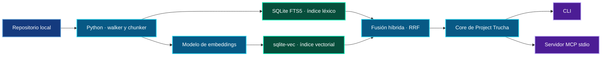
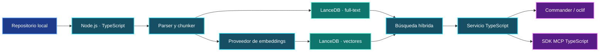
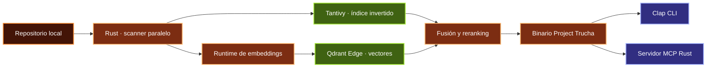
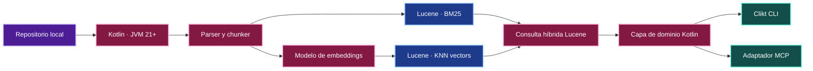
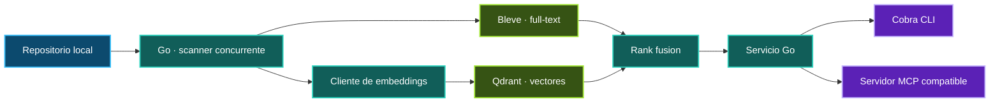
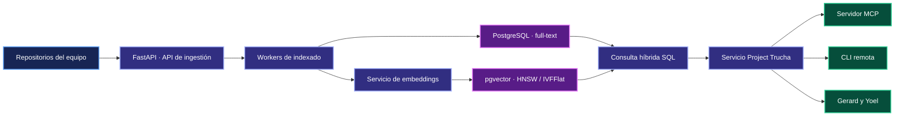

# Alternativas para el stack de Project Trucha

> [!WARNING]
> **Decisión pendiente para Gerard y Yoel.** Este documento compara caminos
> posibles, pero no reemplaza el ADR de arquitectura. Antes de implementar el
> núcleo deben acordar qué optimizar primero: simplicidad local, velocidad,
> familiaridad del equipo o capacidad de crecer como servicio.

  
  
  

  
  
  

## Objetivo común

Las seis alternativas buscan construir el mismo producto:

- indexado incremental de repositorios;
- búsqueda léxica y semántica;
- memoria local de decisiones;
- CLI y servidor MCP para agentes;
- operación local-first con un camino razonable de evolución.

## Comparación rápida

| # | Alternativa | Despliegue | Fortaleza principal | Complejidad inicial |
|---|---|---|---|---|
| 1 | Python + SQLite | Archivo local | Velocidad de desarrollo | Baja |
| 2 | TypeScript + LanceDB | Directorio local | Ecosistema de agentes | Baja–media |
| 3 | Rust + Tantivy + Qdrant Edge | Binario local | Rendimiento y portabilidad | Alta |
| 4 | Kotlin/JVM + Lucene | JVM local | Búsqueda léxica madura | Media–alta |
| 5 | Go + Bleve + Qdrant | Binario + proceso opcional | Operación simple | Media |
| 6 | Python/FastAPI + PostgreSQL/pgvector | Servicio | Colaboración y escala | Alta |

## 1. Python + SQLite FTS5 + sqlite-vec

**Componentes:** Python 3.11+, SQLite/FTS5, `sqlite-vec`, SDK MCP de Python,
Typer o `argparse` para CLI.

### Pros

- Menor cambio respecto del scaffold actual.
- Un solo archivo de datos, fácil de copiar, respaldar y eliminar.
- FTS5 ofrece búsqueda full-text integrada en SQLite.
- Excelente para experimentar con chunking, ranking y embeddings.
- Sin servidor ni Docker para el caso individual.

### Contras

- El paralelismo de escritura y la escala multiusuario son limitados.
- `sqlite-vec` agrega una extensión nativa que debe distribuirse por plataforma.
- Python exige cuidar tiempos de arranque y empaquetado si se busca un binario.

**Elegirla si:** la prioridad es entregar el MVP local-first rápidamente.

## 2. TypeScript + Node.js + LanceDB

**Componentes:** TypeScript, Node.js, LanceDB embebido, SDK MCP de TypeScript,
Commander o oclif para CLI.

### Pros

- El SDK MCP de TypeScript está en el nivel principal de soporte oficial.
- Buen encaje con herramientas de agentes, editores y extensiones web.
- LanceDB es embebido y dispone de APIs JavaScript para búsqueda vectorial.
- Una misma base de lenguaje puede sostener CLI, MCP y una futura interfaz web.

### Contras

- Distribuir Node y dependencias nativas pesa más que un binario único.
- La búsqueda léxica y el ajuste fino de ranking requieren validar la madurez
  concreta del camino elegido en LanceDB.
- El ecosistema npm amplía la superficie de mantenimiento y supply chain.

**Elegirla si:** Gerard y Yoel quieren priorizar integración con agentes y web.

## 3. Rust + Tantivy + Qdrant Edge

**Componentes:** Rust, Tantivy para índice invertido, Qdrant Edge para vectores,
SDK MCP de Rust, Clap para CLI.

### Pros

- Binario portable, rápido y con bajo consumo en ejecución.
- Tantivy está diseñado como motor de búsqueda full-text inspirado en Lucene.
- Qdrant Edge apunta a búsqueda vectorial embebida y offline.
- Buen control de memoria, concurrencia y formatos de almacenamiento.

### Contras

- Mayor curva de aprendizaje y más tiempo hasta el primer MVP.
- El SDK MCP de Rust tiene menor nivel de madurez que Python y TypeScript.
- Integrar dos índices exige diseñar sincronización, recuperación y fusión.

**Elegirla si:** el artefacto final debe ser un binario veloz y autosuficiente.

## 4. Kotlin/JVM + Apache Lucene

**Componentes:** Kotlin, JVM 21+, Apache Lucene para texto y vectores, SDK MCP
de Kotlin o implementación del protocolo, Clikt para CLI.

### Pros

- Lucene es un motor full-text maduro con soporte de búsqueda vectorial.
- Excelente observabilidad, profiling, concurrencia y tooling del ecosistema JVM.
- Cercano a la experiencia Java/Spring del equipo.
- Un único motor puede reducir la duplicación entre ranking léxico y vectorial.

### Contras

- La JVM aumenta tamaño de distribución y tiempo de arranque frente a Go/Rust.
- La API de Lucene es de bajo nivel y requiere una capa de dominio cuidada.
- El SDK MCP de Kotlin figura con madurez todavía por definir.

**Elegirla si:** se prioriza experiencia JVM y control profundo del buscador.

## 5. Go + Bleve + Qdrant

**Componentes:** Go, Bleve para full-text, Qdrant local o remoto para vectores,
implementación MCP compatible, Cobra para CLI.

### Pros

- Compilación rápida y distribución sencilla como binario.
- Bleve ofrece indexado y búsqueda full-text nativos en Go.
- Buen modelo de concurrencia para indexar muchos archivos.
- Qdrant permite comenzar localmente y evolucionar hacia un servicio dedicado.

### Contras

- No hay un SDK oficial de MCP Tier 1 para Go en la matriz consultada.
- Dos motores implican consistencia, backups y fusión de rankings.
- Menos librerías de embeddings locales que Python.

**Elegirla si:** se busca operación sencilla y un servicio pequeño y concurrente.

## 6. Python + FastAPI + PostgreSQL + pgvector

**Componentes:** Python, FastAPI, PostgreSQL full-text, pgvector, SDK MCP de
Python, Alembic para migraciones.

### Pros

- Datos, metadatos y vectores bajo transacciones ACID.
- pgvector soporta búsqueda exacta y aproximada con índices HNSW e IVFFlat.
- Adecuado para equipos, permisos, auditoría y múltiples repositorios.
- Camino claro hacia despliegue centralizado y copias de seguridad maduras.

### Contras

- Contradice el objetivo de cero infraestructura para el usuario individual.
- Requiere servidor, migraciones, credenciales y operación continua.
- Mayor latencia y más piezas que diagnosticar que una solución embebida.

**Elegirla si:** el producto nace como memoria compartida o multiusuario.

## Recomendación para el primer corte

> [!TIP]
> Para validar el producto, comenzar con **Alternativa 1: Python + SQLite**.
> Mantener `store` detrás de una interfaz y preparar pruebas contractuales. Si
> los benchmarks muestran límites reales, comparar primero LanceDB y Lucene; si
> aparece colaboración multiusuario, evaluar PostgreSQL/pgvector.

## Preguntas que debe responder el ADR

1. ¿El índice debe poder copiarse como un único archivo?
2. ¿Cuántos repositorios y fragmentos debe soportar el MVP?
3. ¿Habrá más de un proceso escribiendo al mismo tiempo?
4. ¿Los embeddings deben generarse completamente offline?
5. ¿Qué pesa más: recall, latencia, tamaño o simplicidad operativa?
6. ¿El servidor MCP será siempre local o también remoto?
7. ¿Qué stack pueden mantener Gerard y Yoel durante los próximos doce meses?

## Fuentes técnicas

- [SQLite FTS5](https://www.sqlite.org/fts5.html)
- [SDK oficiales de MCP](https://modelcontextprotocol.io/docs/sdk)
- [LanceDB](https://docs.lancedb.com/faq/faq-oss)
- [Tantivy](https://docs.rs/tantivy/latest/tantivy/)
- [Qdrant](https://qdrant.tech/documentation/)
- [Apache Lucene](https://lucene.apache.org/)
- [Bleve](https://blevesearch.com/)
- [pgvector](https://github.com/pgvector/pgvector)
