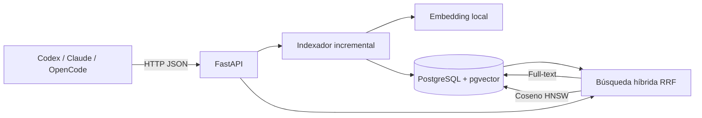

# Despliegue FastAPI + PostgreSQL + pgvector

> [!IMPORTANT]
> Esta implementación vive en la rama `feature/maxi/fast-api`. Usa Docker Compose,
> ejecuta las migraciones automáticamente y no necesita claves de una API de IA:
> el embedding inicial es local y determinístico.

## Arquitectura



## Inicio rápido con Docker Compose

Requisitos: Docker Engine con el plugin Compose.

```bash
cp .env.example .env
docker compose up --build -d
docker compose ps
curl http://localhost:8000/health
```

La API queda en `http://localhost:8000`, Swagger UI en
`http://localhost:8000/docs` y OpenAPI en `http://localhost:8000/openapi.json`.
Al arrancar, el contenedor ejecuta `alembic upgrade head` antes de Uvicorn.

## Probar el flujo completo

El Compose monta este repositorio como sólo lectura en
`/workspace/project-trucha`.

```bash
curl -X POST http://localhost:8000/api/v1/repositories \
  -H "Content-Type: application/json" \
  -d '{"name":"project-trucha","root":"/workspace/project-trucha"}'
```

Copiar el `id` devuelto y ejecutar:

```bash
curl -X POST http://localhost:8000/api/v1/repositories/REPOSITORY_ID/index

curl -X POST http://localhost:8000/api/v1/search \
  -H "Content-Type: application/json" \
  -d '{"query":"servidor MCP hola mundo","repository_id":"REPOSITORY_ID","limit":5}'
```

Guardar una decisión:

```bash
curl -X POST http://localhost:8000/api/v1/decisions \
  -H "Content-Type: application/json" \
  -d '{"repository_id":"REPOSITORY_ID","title":"Backend del MVP","body":"FastAPI con PostgreSQL y pgvector","paths":["compose.yaml"],"author":"equipo-trucha"}'
```

## Variables de entorno

| Variable | Valor predeterminado | Uso |
|---|---|---|
| `POSTGRES_DB` | `trucha` | Base creada por PostgreSQL. |
| `POSTGRES_USER` | `trucha` | Usuario de la base. |
| `POSTGRES_PASSWORD` | `trucha-local` | Cambiar obligatoriamente fuera del entorno local. |
| `TRUCHA_PORT` | `8000` | Puerto publicado en el host. |
| `TRUCHA_ALLOWED_ROOTS` | `/workspace` | Lista separada por comas de raíces que la API puede indexar. |
| `TRUCHA_DATABASE_URL` | definida por Compose | URL SQLAlchemy async. |

Para agregar otros repositorios, montar cada carpeta como volumen de sólo lectura
en el servicio `api` y agregar su raíz a `TRUCHA_ALLOWED_ROOTS`.

## Operación y despliegue

```bash
docker compose logs -f api
docker compose restart api
docker compose pull
docker compose up --build -d
```

La base usa el volumen nombrado `postgres-data`. `docker compose down` conserva
los datos; `docker compose down -v` los elimina de forma irreversible.

Para producción, construir la imagen desde el `Dockerfile`, publicar el puerto
sólo detrás de TLS/reverse proxy, usar secretos gestionados para la contraseña y
realizar copias de seguridad del volumen PostgreSQL. La API todavía no incluye
autenticación, por lo que no debe exponerse directamente a Internet.

## Desarrollo sin contenedor para la API

Con PostgreSQL/pgvector accesible:

```bash
python -m venv .venv
python -m pip install -e ".[dev]"
alembic upgrade head
uvicorn trucha.interface.api.app:app --reload
pytest
```
